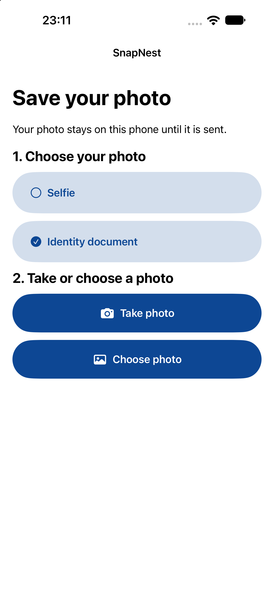
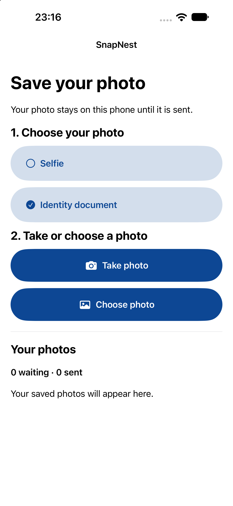

# SnapNest

A native iOS project built with Swift and SwiftUI.

## Current stage

The app now supports native camera and photo-library capture, image preparation, and saving before delivery. A shared core package provides SQLite persistence, bounded queue management, idempotent mock receipts, and serial automatic retries. Startup, lifecycle, and connectivity are connected. The capture and queue interface now shows saved items, waiting/sent counts, upload states, manual Retry, paginated history, and sent-history cleanup. Disconnection feedback includes Check connection. Reviewer failure controls are now available from the sliders button, including simulated offline mode, dropped requests, latency, server errors, and lost confirmation after acceptance.

## Run

1. Open `SnapNest.xcodeproj` in Xcode (Xcode 16 or newer, Swift 6).
2. Select the `SnapNest` scheme and an iPhone simulator; press Run.
3. On a physical iPhone, select your signing team in Signing & Capabilities.
4. Choose Selfie or Identity document, then Take photo or Choose photo. Camera availability depends on the device; the library can be used on a simulator.
5. Open Demo controls from the sliders button to change request failure settings at runtime and inspect the unique acceptance count.

Minimum deployment target: iOS 17. No third-party runtime dependencies.

## Concepts and decisions

See [Concepts and decisions](docs/decisions.md) for plain-language explanations of the components and the choices behind them.

## Tests

Run `swift test` from the repository root. The current tests cover exponential retry delay, atomic persistence and rollback, input and capacity limits, the 10,000-record boundary and pagination, exclusive claims, interrupted-upload recovery, persisted retry timing, manual retry with the same capture ID, sent-history cleanup that preserves pending captures, receipt persistence/deduplication with conflict rejection across reopening, and coordinator success, automatic/manual retry, cancellation, incorrect receipts, lost confirmation, injected failures, and repeated saves/resumes.

Delivery runs while the app is active, the OS reports a satisfied network path, and demo offline mode is disabled. It pauses on inactivity or disconnection and recovers interrupted work on foreground entry. The endpoint remains an in-app mock; network-path availability is not proof that a remote service is reachable. Physical Wi-Fi interruption/recovery remains a manual validation gap.

## Progress evidence

Capture screen after adding native photo capture controls. Checked on the iPhone 18 Pro Max simulator, iOS 27. This shows the screen rendered; end-to-end picker/upload validation and physical camera validation remain outstanding.

Queue interface after adding history and status controls, shown with an empty queue on the iPhone 18 Pro Max simulator, iOS 27. Build and launch passed; this screenshot does not validate populated states or the end-to-end upload flow.

## Reviewer failure controls

| Control | Simulated behaviour |
| --- | --- |
| Go offline | Pauses/cancels delivery while keeping captures saved. Turn it off to re-evaluate connectivity and resume. |
| Drop uploads | Each request has the selected probability of failing before acceptance (0–100%). |
| Delay | Adds 0–15 seconds before processing each request. |
| Server errors (503) | Produces the mock service-busy error; no actual HTTP response is sent. |
| Lose response after acceptance | Commits the receipt, then reports interrupted confirmation to the client. |

Settings apply to the next request; offline cancels the current worker. They reset on full relaunch while captures and receipts persist. Endpoint evidence shows the number of unique accepted IDs; repeated requests with the same ID and bytes return the existing receipt. The existing core tests cover forced offline/drop/server failures and response-loss deduplication; native controls and capture-flow UI tests arrive in the next validation step.
