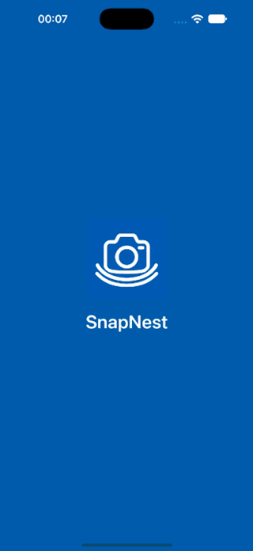

# SnapNest — native iOS assessment

A Swift / SwiftUI proof of concept for iiDENTIFii's capture-and-delivery problem. Capture a selfie or identity-document image; commit it locally before attempting delivery; resume safely after interruptions. The default endpoint is an **in-app mock with its own SQLite receipt database**, as allowed by the assessment. No personal data leaves the device.

<p align="center">
  
</p>

Recorded on the iOS simulator: launch → save offline → reconnect → sent → relaunch.

## Run

1. Open `SnapNest.xcodeproj` in Xcode (Xcode 16 or newer, Swift 6).
2. Select the `SnapNest` scheme and an iPhone simulator; press Run. No packages need downloading and no backend needs starting.
3. On a physical iPhone, choose your signing team in Signing & Capabilities. The app targets **iOS 17+**; photo selection works on simulators without a usable camera.
4. Choose **Identity document** or **Selfie**, then **Take photo** or **Choose photo**. The image becomes a queue item as soon as its local transaction commits.
5. Open the sliders button, **Demo controls**, to inject offline mode, 0–100% request drops, 0–15 seconds latency, simulated server errors, or loss of confirmation *after* endpoint acceptance. Controls do not require rebuilding.

The Xcode project and shared scheme are checked in; no project-generation tools are needed to open or build it.

### Tests

```sh
swift test
swift build --product QueueProbe
python3 scripts/crash_stress.py
```

The unit tests run the same core actors and real SQLite persistence on macOS, with transport boundaries simulated. The stress script launches the real Swift queue writer, sends SIGKILL, and reopens its database. Python 3's standard library is sufficient. Run from the repository root. For native UI checks:

```sh
xcodebuild -project SnapNest.xcodeproj -scheme SnapNest \
  -destination 'platform=iOS Simulator,name=YOUR_SIMULATOR' test
```

Import `fixtures/demo-document.png` **last** so it is the newest library image (`xcrun simctl addmedia booted fixtures/demo-document.png`). The UI recovery test checks the accepted-count increase against its initial value and can be rerun without deleting history. It targets the native picker extension on iOS 27; a coordinate fallback is documented in the test for runtimes that omit that grid from their accessibility snapshot. Test artifacts and measured results are described in `docs/Validation.md`. The [25.9-second demonstration](demo/SnapNest-demo.mov) records a passing native photo-selection, reconnection, and relaunch scenario.

## Reviewer scenarios

| Scenario | Steps | Expected result |
| --- | --- | --- |
| Offline capture | Demo controls → Go offline; choose a photo | Saved, waiting; no accepted receipt |
| Connection restoration | Turn Go offline off | Automatically sends the saved photo |
| Background mid-upload | Set delay to 15 s; capture; leave app; return | In-flight work is cancelled/recovered; same ID is resent |
| Force quit mid-upload | Set delay to 15 s; capture; force quit; reopen | Queue survives; sends original ID; sent items are not resent |
| Retry exhaustion | Enable server errors, capture; allow five attempts | Failed photo stays saved; Retry remains available |
| Manual retry | Disable errors; tap Retry | Same item, renewed attempt budget, confirmed success |
| Ambiguous success | Enable Lose response after acceptance; capture | Endpoint count rises once, client stays failed |
| Duplicate rejection | Disable lost response; Retry that photo | Sent; endpoint's unique accepted count does not rise |
| Large text | Set system text size to maximum | Content grows and scrolls; primary controls remain reachable |
| Queue write kill | Run `scripts/crash_stress.py` | Every acknowledged save survives; no half-written rows |
| 10,000 entries | Run the capacity unit test | 10,001st save rejected; earlier pending captures preserved |

Failure settings apply to the next request, except offline mode cancels the current worker. They reset on full relaunch so a reviewer can recover without being stuck offline. Persistent queue and receipts do not reset. “Server errors (503)” is a mock error outcome, not an actual HTTP response.

## 1. Design, concurrency and threading

The boundary that matters is **durable commit**, not tapping the shutter. Image processing converts an image to an upright JPEG (maximum dimension 1,600 px; at most 2 MiB). `QueueStore.save` inserts the bytes, UUID, type, timestamp, and pending state in **one SQLite transaction**. Only after COMMIT can `UploadCoordinator` claim it. The UI never says “saved” before that call returns. If saving fails, it reports the failure and keeps the prepared bytes in memory for another save attempt. Capture cancellation creates no queue item.

`QueueStore` is an actor with one SQLite connection. Database operations and transactions are synchronous inside the actor, so they cannot interleave at `await`. The rollback journal and `synchronous=FULL` provide process-crash consistency. A process killed during a transaction leaves either the previous committed database or the complete new row, not a dangling image reference. No migration strategy is needed for this first schema; a released app would require explicit schema versioning.

`CaptureModel` is `@MainActor`: published UI state changes on the main thread. `ImageProcessor` is a separate actor, downsampling via ImageIO without fully decoding the original into a large bitmap. The camera system returns a `UIImage`; its initial JPEG encoding occurs in the main-actor delegate, a remaining performance tradeoff. Camera and library selection use the same UIKit picker bridge; initial UIImage-to-JPEG encoding happens on the UI actor. A short UIKit background task gives image preparation and save time to finish during ordinary backgrounding; it cannot prevent a force quit.

`UploadCoordinator` owns one worker task. Actors are reentrant across `await`, so actor isolation alone does not ensure one complete request at a time: the worker handle provides that guarantee, and a wake flag prevents a capture from being stranded while a previous drain is exiting. The queue claim changes pending/eligible failed to uploading and increments attempts in a transaction. A request's UUID and SHA-256 digest must both match the returned receipt before marking uploaded. That update also releases the local image BLOB.

Lifecycle changes pause delivery and await cancellation cleanup. Foreground recovery turns unconfirmed uploading rows back into pending. `NWPathMonitor` resumes on restored connectivity. Retry uses persisted next-attempt timestamps and exponential backoff: 2, 4, 8, 16 seconds between the five automatic attempts. Five unsuccessful attempts leave a failed item requiring manual Retry; a failed item does not block another eligible item. Manual retry resets only a failed item's attempt budget, never its identity.

The mock endpoint uses a separate disk database. The same UUID and digest returns the same receipt; the same UUID with different bytes is rejected. This is **at-least-once delivery with an idempotent receiver**. No client can reliably distinguish a server rejection from “server committed, response lost” without cooperation from the receiver.

### Guarantees and boundaries

- Once the app acknowledges a committed save, a process kill does not silently lose it. A transaction interrupted before commit can roll back; a shutter result still in memory is not yet durable. An app cannot promise otherwise during a force quit. The UI exposes this boundary as Saving versus Saved.
- There is no promise of continued delivery while suspended or force quit. Delivery pauses and resumes when the app becomes active. iOS does not automatically relaunch an app the user force quit, including background URLSession transfers.
- The proof of concept has an in-app endpoint, not a real network service. OS connectivity is observed; request failures are injected at the transport boundary. No production backend or live HTTP behavior is claimed.
- Device destruction, app uninstall, filesystem corruption, power-loss durability on faulty hardware, and clearing app data are outside the process-kill guarantee.
- Initial image-loading/encoding can fail; corrupt or oversized input is explicitly rejected. The prepared image is retained after a *save* failure only until the app process ends.

## 2. Tradeoffs and libraries

**iOS 17 minimum:** supports the SwiftUI APIs used here and includes older hardware such as the iPhone XR. This is a deliberate compatibility choice, not a declaration that every banking client's device is supported. We compile against the installed SDK; runtime checks on iOS 17 hardware remain a validation gap.

**No third-party runtime libraries.** SwiftUI, UIKit, ImageIO, Network, CryptoKit and SQLite ship with Apple platforms. A tiny `CSQLite` module exposes the system C library; it is not an external SQLite build. XCTest is the test framework. Ruby `xcodeproj` generated the checked-in development project; it is not linked into the app and is not required by reviewers. Python is used only for the kill-test harness.

**SQLite BLOB instead of separate image files:** one atomic resource is simpler than coordinating file renames with metadata. This increases database size, copy cost and journal I/O, but is defensible for a bounded small app. DELETE journaling keeps file management simple; FULL synchronization prioritizes acknowledged-save integrity over capture throughput. The private connection lifetime holder has one narrow `@unchecked Sendable` assertion: only its owning actor accesses the handle, and destruction closes it after ownership ends. No raw handle is publicly exposed.

**Serial upload:** predictable memory use (one upload payload), straightforward cancellation, and simpler state transitions, at the cost of throughput. The default mock delay is one second. We avoid a background URLSession implementation because an in-app mock needs no network session; durable foreground resumption satisfies the requested recovery behavior.

**Simple interface:** clear two-step capture, large buttons, plain status text and icons, no information conveyed only through color, scrollable Dynamic Type layout. History loads 50 metadata records at a time and includes navigation to every page. No image thumbnails avoids decoding a queue's worth of photos.

## 3. Deliberately not built

No biometrics, liveness, ML, authentication, user accounts, multi-device sync, production deployment or CI pipeline, matching the assessment's exclusions. No real backend: the permitted persistent mock demonstrates lost responses and duplicate handling within the timebox. No elaborate navigation, design system, telemetry service, or thumbnails. No continuous execution guarantee after force quit. No claim that a photo is a valid identity document; content validation is outside scope.

This is not production biometric storage. The app uses Application Support, marks its directory excluded from backups, inherits iOS file protection until first unlock, removes logical image bytes after confirmed upload, and avoids logging images or identity data. Production requires retention policy, stronger privacy review, encryption/key decisions, and secure deletion considerations; SQLite's freed pages are not a promise of forensic erasure.

## 4. What breaks first as this scales, and where

**The queue is bounded in code:** 10,000 total capture rows (including sent history) and 512 MiB of outstanding image bytes. At most 2 MiB per capture. Whichever limit is reached first rejects the new save and explains storage is full; existing pending photos are never evicted. At 10,000 pending records the 10,001st is rejected. With typical larger images the byte cap arrives sooner. Sent images release byte capacity; the user can remove sent metadata history from the main screen or Demo controls to free record capacity. This never clears pending/failed images or endpoint receipts.

The 512 MiB cap measures logical image bytes, not total filesystem consumption. SQLite pages, rollback journals, metadata and temporary VACUUM space require headroom. Disk-full errors are reported rather than acknowledged as saved. Database file pages may retain their high-water allocation until history cleanup's VACUUM. At 10,000 rows, aggregate capacity/count queries scan metadata and become the first local capture-latency cost; the UI still loads only 50 metadata rows, not 10,000 BLOBs.

Serial delivery is the first throughput bottleneck. A 10,000-item backlog with a one-second delay takes at least 2.8 hours of active time, longer with retries. In a real backend, use bounded concurrency, a fair retry scheduler and small resumable uploads as requirements justify them. Deterministic backoff without jitter would cause synchronized retries across a fleet; add jitter and Retry-After handling for real networking.

Mock receipts are retained indefinitely to make duplicate handling demonstrable even after history cleanup. That database is a separate unbounded backend-history decision, not a hidden queue default; production needs an explicit idempotency retention contract and capacity policy. It stores only IDs and digests, not photos. A backend's expired receipt must never be interpreted by the client as proof of delivery.

## 5. AI use: accepted, rejected and refined

AI assisted with implementation, tests, debugging, and documentation. Suggestions were checked through local builds, automated tests, and simulator runs. The main decisions and their tradeoffs are recorded in `docs/decisions.md`.

**Accepted:** a transactional SQLite queue, a separate receipt store for idempotency, serial delivery, and explicit capacity limits. These support saving before delivery and retrying safely without adding unnecessary infrastructure.

**Rejected or refined:** actor isolation alone was insufficient to serialize uploads across suspension points, so the coordinator uses a single worker task. A wake flag addresses captures arriving as the worker finishes. Connection lifetime handling was adjusted for iOS 17 compatibility, and storage errors are surfaced to the user. UIKit photo selection replaced the unavailable SwiftUI picker in the tested simulator environment.

**Clarified guarantees:** persistence begins when the local transaction commits; an image still in memory can be lost if the process ends. Delivery resumes while the app is active, and receiver receipts prevent duplicate acceptance after a lost response. Validation covers the implemented mock endpoint and shared storage, with physical-device and real-network limitations documented separately.

## 6. With four more hours

1. Physical-device QA: camera permission denial/cancellation, repeated captures, lock/background timing, low storage, memory pressure and iOS 17; VoiceOver plus maximum text on a smaller phone.
2. Replace the in-app transport with a small local HTTP service using SQLite, a real unique idempotency constraint and conflict responses; preserve the same protocol and tests. Add timeout, Retry-After, jitter and response-validation tests.
3. Add deterministic persistence interruption/fault injection around begin/write/commit and a migration test, beyond the random SIGKILL stress evidence. Make storage usage/capacity clearer before opening the camera.
4. Profile photo preparation; move initial camera encoding off the UI path safely, evaluate a modern file-based photo picker on physical devices to limit source-data memory, and add tests for orientation, oversized inputs and save-failure recovery. Add bounded receiver-receipt retention once the duplicate-window contract is specified.

## Source map and preparation

- `App/ContentView.swift`: user flow and reviewer controls.
- `App/ImageCapture.swift`: camera bridge and image processing.
- `App/CaptureModel.swift`: UI state, lifecycle, connectivity and capture orchestration.
- `Sources/CaptureCore/QueueStore.swift`: durable queue and mock receipts.
- `Sources/CaptureCore/Upload.swift`: protocol, mock endpoint, retry worker.
- `Tests/CaptureCoreTests/`: persistence and retry/resume tests.
- `UITests/`: native photo selection / relaunch / large-text checks.
- `docs/Walkthrough.md`: detailed Flutter-to-Swift explanation and follow-up questions.
- `docs/Validation.md`: evidence, commands, recording and remaining gaps.

Technical references: [SQLite atomic commit](https://www.sqlite.org/atomiccommit.html), [SQLite synchronization pragmas](https://www.sqlite.org/pragma.html#pragma_synchronous), [Swift concurrency](https://docs.swift.org/swift-book/documentation/the-swift-programming-language/concurrency/), [Apple background-session force-quit behavior](https://developer.apple.com/documentation/foundation/urlsessionconfiguration/background(withidentifier:)).

## Concepts, decisions and progress

See [Concepts and decisions](docs/decisions.md) for explanations and Mermaid diagrams, and [Validation](docs/Validation.md) for stage screenshots, test results, and remaining gaps.

## Progress screenshots

- [Capture controls](docs/images/capture-screen.png): native capture stage.
- [Queue interface](docs/images/queue-screen.png): empty history at the queue UI stage.
- [Maximum text](docs/images/maximum-text.png): reachable Choose photo control after scrolling.

## Submission archive

After committing the reviewed final files, run `python3 scripts/package_submission.py`. It creates `submission/SnapNest-assessment.zip` from tracked files and local Git history, excluding untracked build outputs and diagnostic bundles. The archive is generated locally and should be inspected before sharing.
