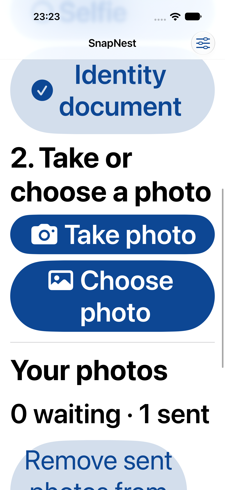

# Validation

Checked on 5 October 2026 against the prepared native UI validation stage.

## Automated results

| Suite | Environment | Result |
| --- | --- | --- |
| CaptureCore (`swift test`) | macOS, Swift package | 20 passed; 0 failures |
| SnapNestUITests (`xcodebuild test`) | iPhone 18 Pro Max simulator, iOS 27.0 | 3 passed; 0 failures; 0 skipped |

The core tests cover atomic save/reopen/rollback, image and capacity limits, 10,000-record pagination, exclusive claims, interrupted-upload recovery, retry scheduling/manual retry, cleanup, persistent receipt deduplication and conflicts, worker cancellation, incorrect receipts, injected failures, and lost confirmation.

The native UI scenarios cover:

- Selecting a synthetic library image while demo offline, observing Waiting to send, turning demo offline off, observing Sent before relaunch, and checking the acceptance count remains unchanged after relaunch.
- Repeating the demo offline on/off cycle twice and checking the banner disappears.
- Reaching Choose photo by scrolling at maximum accessibility Dynamic Type.

The photo picker exposes an accessible photo element on the checked run. The test also retains the existing iOS 27 first-tile coordinate fallback; it depends on importing the fixture last into a dedicated test simulator.

## Progress screenshot

Exported from the successful native UI test attachment and visually checked. The screenshot shows Choose photo reachable after scrolling; it does not establish full accessibility compliance.

## Boundaries and remaining validation

Delivery uses an in-app mock endpoint. Failures and confirmations exercise the real queue worker, but do not validate an HTTP server or packet-level upload resumption. Demo offline recovery does not prove host Wi-Fi interruption recovery.

Physical camera/permission behaviour, VoiceOver, real Wi-Fi interruption and recovery, iOS 17 runtime behaviour, and physical-device storage/memory behaviour remain unverified. The relaunch UI test terminates after successful confirmation; it is not a process-kill-during-write test. Shared-store process-kill evidence is recorded below; physical iOS force-quit testing remains outstanding.

No production application changes were needed for this stage. The additions are the UI test target/shared scheme, existing test scenarios, synthetic fixture, documentation, and selected screenshot. Result bundles and build outputs remain local.

## Shared-store process-kill stress

On 5 October 2026, `swift build --product QueueProbe` succeeded and `python3 scripts/crash_stress.py` passed all 12 runs. The probe calls the real QueueStore and emits each UUID only after save returns from its commit. The script sends SIGKILL at increasing delays, reopens the database, runs SQLite integrity checking, and checks acknowledged IDs plus each row's image length, recorded size, and pending state.

| Run | Acknowledged captures | Intact rows after kill |
| --- | ---: | ---: |
| 1 | 0 | 0 |
| 2 | 10 | 10 |
| 3 | 17 | 17 |
| 4 | 18 | 18 |
| 5 | 20 | 20 |
| 6 | 22 | 22 |
| 7 | 24 | 24 |
| 8 | 24 | 24 |
| 9 | 26 | 26 |
| 10 | 27 | 27 |
| 11 | 12 | 12 |
| 12 | 29 | 29 |

Every acknowledged ID survived, all checked rows had a 1 MiB image/size and pending state, and all integrity checks passed. The first run ended before any acknowledged save. Timing is nondeterministic; this does not prove termination at a particular transaction instruction. Image contents are not compared byte for byte by this stress script. It runs on macOS using the shared store, not inside a physical iOS app. No production app or core persistence behaviour changed.
