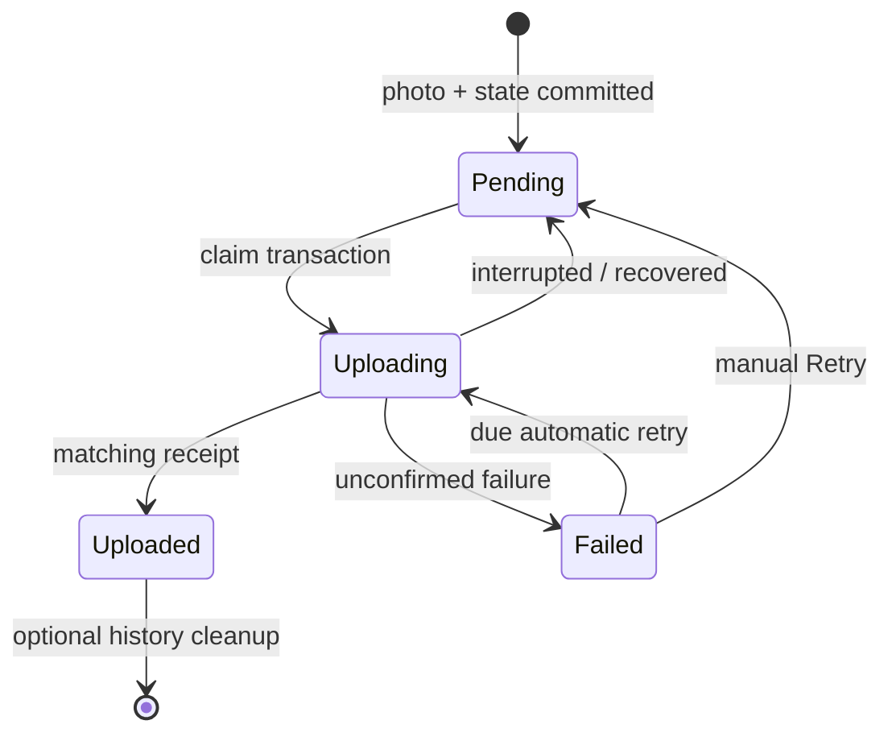

# Understand and defend SnapNest

This guide is for a Flutter developer learning the native implementation. Read it with the files open. The goal is to understand the decisions well enough to explain them in your own words, including where they fall short. Do not claim experience or guarantees you have not personally verified.

## Start with the problem

The assessment is about reliability. A user takes a photo, but their connection drops or they close the app. A naive app holds the image in RAM and starts an upload; the process ends, RAM disappears, and the photo is gone. Even if you save the photo, a server might accept it and then the response gets lost. Blindly trying again can create two verifications.

We built a native iOS app that separates **capture**, **durable save**, **delivery**, and **confirmation**. Each photo has a UUID that stays the same through every retry. The queue lives in SQLite. The mock receiver remembers accepted UUIDs and image hashes in a separate SQLite database.

A useful opening explanation:

> “I chose SwiftUI for the user interface and a transactional SQLite queue for reliability. I persist the photo bytes and their pending state together before delivery. A serial upload actor retries unconfirmed work using the original UUID. The receiver stores an idempotency receipt, so an accepted request can be repeated safely after its response is lost. The interface tells the user whether the photo is saved or sent. The main limitation is that delivery resumes when the app is active; I do not claim continuous execution after a force quit.”

Explain each choice in your own words after reviewing the implementation and its tradeoffs.

## Translate your Flutter knowledge

| Flutter / Dart concept | What appears here | Important difference |
| --- | --- | --- |
| A `Widget` and `build` | SwiftUI `View` and `body` | `body` describes UI from current state; it can be reevaluated frequently |
| `StatefulWidget` owning a controller | `@StateObject` owning `CaptureModel` | The object survives view-value reconstruction |
| A passed notifier / controller | `@ObservedObject` | The child observes an object owned elsewhere |
| `setState` / `ChangeNotifier` | `@State` / `@Published` | SwiftUI subscribes and updates when the values change |
| `Future`, `async`, `await` | Swift `async`, `await`, `Task` | Tasks have cooperative cancellation, and isolation is checked by the compiler |
| `try/catch` | `do/try/catch` | Swift requires `try` at throwing calls |
| Repository / service class | `QueueStore` actor | Its mutable state is isolated from other concurrent work |
| Abstract class / interface | `UploadTransport` protocol | Both real implementations and test doubles conform to it |
| An isolate | No exact one-to-one equivalent | A Swift actor serializes access to its state; it is not a dedicated OS thread or Dart isolate |
| `sqflite` | System SQLite through C functions | We handle statements, bindings, finalization and transactions ourselves |
| App lifecycle observer | SwiftUI `scenePhase` | Active/inactive/background changes drive delivery pause/resume |
| Connectivity plugin | `NWPathMonitor` | A satisfied network path does not prove a remote server is reachable |
| `image_picker` | A UIKit picker bridge | SwiftUI wraps the existing native camera controller |

## Follow one image through the files

### 1. The app starts — `SnapNestApp.swift`

`@main` identifies the application's entry point. The app owns one `CaptureModel` with `@StateObject`. The window presents `ContentView(model: model)`. Its task calls `start()` once; `scenePhase` changes call `setActive`.

Why own the model at the app level? If a view redraws or a sheet appears, we do not want a new queue coordinator or network monitor. A view is a description; persistence and delivery have longer lifetimes.

### 2. Services are wired — `CaptureModel.swift`

The class is `@MainActor`, so its observable UI state is updated on the main thread. It creates an Application Support directory, excludes it from backups, and sets iOS file protection. It opens `queue.sqlite` and a separate `mock-receipts.sqlite`.

It constructs the store, endpoint and upload coordinator. The coordinator's change callback refreshes the UI. `[weak self]` avoids having the callback strongly retain the model while the model retains the coordinator. `recoverInterrupted` runs before initial delivery, turning any previous uploading state into pending.

The model starts `NWPathMonitor` on a separate dispatch queue. Its callback hops back to `@MainActor` before changing published state. Calling `await` is not a way to “run everything on a background thread”; it allows a task to suspend and switch to the appropriate isolation domain.

`refresh` collects database results before publishing them together. Its generation counter discards a previous refresh if a newer page or state refresh started while it awaited the store. This avoids an older query replacing newer screen state.

`start` has a guard because SwiftUI tasks can be invoked again. Errors are visible; the database is never deleted as a recovery shortcut.

### 3. The user chooses an image — `ContentView.swift` and `ImageCapture.swift`

The UI asks for a selfie or document, then offers the camera when available and photo-library selection. Camera permissions are requested only when the user chooses the camera. Denial produces a short message directing them to Settings or photo selection. Cancel returns no image and inserts no row.

`ImagePicker` conforms to `UIViewControllerRepresentable`. Think of it as a small native bridge: SwiftUI owns the presentation, `UIImagePickerController` supplies the camera or library UI, and its delegate returns the selected/captured image. The modern SwiftUI PhotosPicker remained stuck on Loading in this environment, so it was replaced with the UIKit library picker after observed failures. That choice and memory cost must be explained openly. A “Coordinator” here is the UIKit delegate adapter; it is different from the upload coordinator actor.

The capture kind is frozen when opening the camera or selecting a photo. It must not change just because the user later changes the selection in the underlying screen.

`ImageProcessor` uses ImageIO to make an upright thumbnail with a maximum dimension of 1,600 pixels. It encodes a new JPEG at quality 0.8. We reject source data above 30 MiB and processed data above 2 MiB. Reencoding avoids retaining the original's metadata such as GPS. These are PoC size choices, not proof that biometric/document image quality is adequate for a real verification provider.

The actor keeps resizing/encoding work away from the UI's actor. Camera and library initially return a UIImage, and conversion to JPEG is still done by the main-actor delegate before the size check. The source-image allocation can therefore be larger than the intended memory budget. These are known improvements, not hidden production readiness claims.

A short background task is requested around preparation/save. This gives ordinary backgrounding a chance to complete; iOS controls the time and a force quit still ends the process.

### 4. Bytes become durable — `QueueStore.save`

The actor opens a single SQLite connection. Its private lifetime holder closes the connection when no longer owned. `@unchecked Sendable` is deliberately confined to that holder: the pointer is never exposed, and only the actor uses it. Removing confinement or sharing that handle would invalidate the assertion.

Important C API details:

- `sqlite3_prepare_v2` compiles SQL into a statement.
- `sqlite3_bind_*` supplies values safely without constructing SQL from user input.
- `sqlite3_step` runs the statement or returns the next row.
- `sqlite3_finalize` releases statement resources; `defer` makes this happen on both success and failure.
- The `SQLITE_TRANSIENT` destructor value tells SQLite to copy Swift's string/BLOB bytes. Without copying, SQLite could retain pointers after Swift's temporary memory stops being valid.

`BEGIN IMMEDIATE` establishes the write transaction. Inside it, we check record and byte capacity. Then one INSERT writes the UUID, kind, timestamp, pending state, image and size. COMMIT is the point after which `save` returns success. Any thrown error attempts ROLLBACK.

Why keep bytes in the database? If we wrote an image file and later wrote JSON state, a crash between the writes could produce an orphan image or a broken reference. A single transaction avoids that coordination problem. It is a conscious disk-I/O tradeoff; a larger production system might use staged files, atomic rename and reconciliation.

`journal_mode=DELETE` uses SQLite's rollback journal. `synchronous=FULL` asks SQLite to synchronize writes. The guarantee relies on SQLite and the underlying filesystem behaving correctly. It addresses process interruption; it does not make device destruction, uninstall or arbitrary storage corruption recoverable.

The model only starts/resumes delivery after the save succeeds. Before it succeeds the UI shows Saving. On a write failure, the prepared data remains in view state and **Save photo again** is available. If the process is force quit before a commit, those memory-only bytes are not guaranteed to survive. Never say the app can guarantee an image before persistence has happened.

### 5. The worker claims the item — `UploadCoordinator` and `QueueStore.claim`

`resume` enables work and starts a task only if none is running. Repeated foreground/connectivity notifications must not start independent workers. If a worker is already running, `needsAnotherPass` remembers a wake request, including the race where the worker is about to exit after seeing an empty queue.

An actor protects its variables, but `await transport.upload` suspends the current actor method. Another actor call may execute while it waits. This is **reentrancy**. Keeping one worker task is what serializes whole requests across that await.

`claim` selects the oldest due pending/failed item whose attempts are below the limit. In the same transaction it changes the state to uploading and increments attempts. Uploaded rows are not eligible. Another claim cannot take an uploading item.

The bytes are read only for the one claimed item. The UI reads pages of metadata and does not load image BLOBs. This avoids making a 10,000-item queue into a memory problem.

### 6. The endpoint confirms — `MockEndpoint.upload`

The endpoint snapshots failure settings when a request begins. It can delay, drop a percentage of calls, fail before acceptance, or fail after acceptance. Task cancellation is checked before receipt acceptance.

The separate receipt database uses UUID as a primary key. On a new UUID it inserts a SHA-256 digest. On a repeated UUID with the same digest it returns the original receipt. A different digest produces a conflict error.

The upload coordinator checks both UUID and digest before setting uploaded. A generic “success” associated with another image would be insufficient. SHA-256 binds the receipt to the transmitted bytes; it does not authenticate a real server. A real endpoint also needs TLS and a defined response contract.

On confirmed upload we remove the local image BLOB and set its logical byte count to zero. We keep metadata so the user can see Sent. SQLite may retain freed pages; this is not forensic secure erasure.

### 7. An error happens — retry and resume

After a transient failure, the durable state becomes failed with a message and a persisted next-attempt timestamp. The worker sleeps until the earliest eligible next time and continues. Delays after the first failures are 2, 4, 8 and 16 seconds. The delay function itself caps at 60 seconds; the normal five-attempt budget reaches failure exhaustion before needing that cap.

After five failures the row remains failed. Later eligible items can still send. Manual Retry sets this failed row to pending, resets attempts and clears next time; its UUID and bytes stay unchanged. The coordinator wakes any current backoff wait safely.

When the app backgrounds or loses connectivity, `pause` cancels the worker and waits for it to resolve its active claim. A cancelled request recovers uploading to pending. If a confirmed receipt arrives during cancellation, confirmed success is still honored. We must not discard proof of acceptance just because the user left the screen.

On full relaunch, durable uploading state means “we do not know whether the previous request completed.” Recovery reuses the same UUID. That is why the server's idempotency rule matters.

## The state machine

“Failed” still means the image is safely stored locally. It does not mean the photo was discarded. After five attempts it needs the user's Retry; before that, retry is scheduled automatically.

## Explain the hardest failure with a concrete example

1. Photo `A` is saved locally.
2. The client sends `A`.
3. The receiver records `A` and its digest.
4. The response disappears.
5. The client cannot prove success, so it keeps the image and retries `A`.
6. The receiver finds `A` already recorded with the same bytes and returns its original receipt.
7. The client marks `A` uploaded; the receiver still has **one** unique record.

If we generate a fresh UUID at step 5, duplicate rejection fails. If we mark uploaded at step 2, data is silently lost when the receiver never accepted it. If we forbid retries to avoid duplication, users lose delivery after ambiguous success. The right solution coordinates a stable client ID with a receiver that remembers it.

## What the tests demonstrate

Persistence tests use actual temporary SQLite databases: bytes and state after reopening, duplicate insertion rollback, input limits, byte limits, a real 10,000-row boundary, exclusive claiming, interrupted recovery, due times/manual retry, release of confirmed image bytes and receipt deduplication/conflicts.

Coordinator tests use the real store and worker with simulated transports: one-time success, retry after errors, exhaustion/manual reset, progress beyond failed items, incorrect receipt rejection, pause/resume and a response lost after acceptance. The mock failure settings are exercised at deterministic 100% drop or forced-error boundaries.

The stress helper runs the actual Swift writer in another process. It logs an ID only after commit, kills the process while it is repeatedly saving 1 MiB images, reopens it, and checks all acknowledged IDs remain intact. Random timing is useful evidence but does not prove every instruction boundary was interrupted; deterministic fault injection would strengthen it.

Native UI checks exercise photo-library selection, offline persistence/relaunch, sent-state retention, endpoint count and maximum text. Consult Validation.md for the actual final outcomes rather than assuming a checked-in test passed.

## Questions you are likely to get

**Why native Swift if you normally use Flutter?**
The assessment explicitly excludes cross-platform implementations. I used SwiftUI's declarative approach, which transfers well from Flutter, and native APIs for lifecycle, capture and connectivity. The reliability design itself is portable to a Flutter repository/service layer.

**Why SQLite rather than UserDefaults?**
UserDefaults is preferences storage, not a transactional image queue. SQLite lets us write image and state atomically, query due work, index the queue and enforce capacity inside the same transaction.

**Why no Core Data or external database wrapper?**
A small schema and direct SQLite keep runtime dependencies at zero and transaction behavior explicit. The cost is manual C API handling and more responsibility for migrations and error diagnostics. Core Data would also be valid if its persistence semantics were explained.

**Does this provide exactly-once delivery?**
No. Requests can be sent repeatedly. It provides at-least-once attempts and idempotent acceptance at the mock receiver. Actual once-only server side effects require a real receiver's transaction and idempotency contract.

**Will it finish an upload when the app is force quit?**
No. It keeps durable work and resumes when relaunched. iOS cancels background transfers after user force quit and does not automatically relaunch the app. I would consider background URLSession for a real backend while preserving the queue and reconciling completions.

**What happens at 10,000 pending items?**
The next save is rejected with a visible storage message; nothing already pending is deleted. The byte cap can reject sooner. We load only 50 metadata items per page. More throughput is a separate concern: one-second serial uploads need at least 2.8 active hours for 10,000 photos.

**Why does a file-protection setting matter?**
These are sensitive photos. iOS protects files at rest and the app excludes them from backups. “Until first user authentication” allows access after the first unlock, including subsequent locking; this is a tradeoff. A real banking flow needs a privacy/security review and retention policy.

**What if the device runs out of disk space?**
SQLite returns a write/commit error. The app does not acknowledge a successful save or begin uploading that unsaved capture. Prepared bytes remain in memory for retry; killing the process can still lose them. The logical queue cap cannot guarantee free physical storage because journals, filesystem usage and other apps also consume space.

**Why not upload ten photos at once?**
Serial upload makes cancellation, memory and state management easy to reason about. Bounded parallelism would improve throughput but needs independent in-flight ownership and cleanup. Unbounded concurrency is never acceptable on constrained phones.

**What if the mock has been wiped but the queue says uploaded?**
The app does not resend confirmed items. The durability assumption includes the receiver retaining confirmed acceptance. A real backend needs an explicit storage and idempotency contract; the client cannot repair arbitrary server data loss by pretending it never happened.

**What would you change first?**
Physical device validation, source-image memory behavior, camera encoding latency, a real HTTP boundary, jitter/timeouts and deterministic disk-fault tests. Explain priorities based on the problem, not a list of fashionable architecture components.

## Read the code in this order

1. `Models.swift`: states, payload, receipt, user-facing errors and retry timing.
2. `QueueStore.save`, `transaction`, `claim`, `recoverInterrupted`, `markUploaded`.
3. `MockEndpoint.upload`, then `accept` and receipt comparison.
4. `UploadCoordinator.resume`, `drain`, `pause`, `retry`.
5. `CaptureModel.start`, `save`, `setActive`, `updateDelivery`.
6. `ImageCapture.swift` and the capture callbacks in `ContentView.swift`.
7. Tests; predict each outcome before running it.

For each function ask: who calls it, which actor owns its state, where can it suspend, what is durable before/after the call, what happens on error, and what happens if the process ends here?

## Rehearse before submission

Run the app yourself. Show an offline photo, relaunch, response loss and retry with unchanged receipt count. Explain one test, not just the number of tests. Find the durable commit and the receipt validation in code without searching. Explain the limitations in your own words. A useful practice session is to ask someone to interrupt you with “What if the app dies right here?” at each await or database operation.

Network recovery: demo offline and real network availability are separate gates. Turning the demo switch off cannot override an unsatisfied NWPathMonitor. Disabling demo offline, foreground entry, and Check connection renew the monitor, with a generation token rejecting obsolete callbacks. This is a recovery action, not proof of internet/server reachability.
