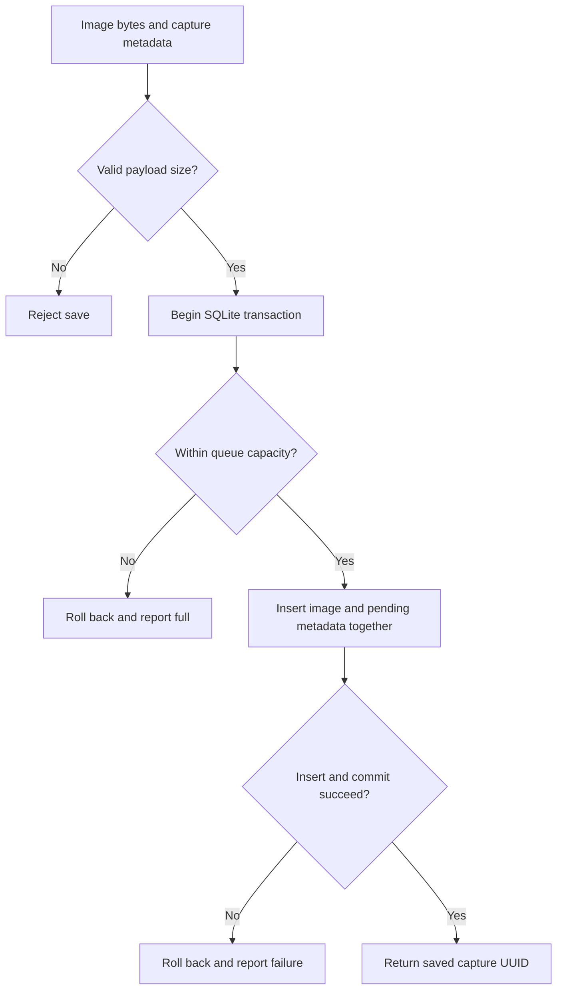
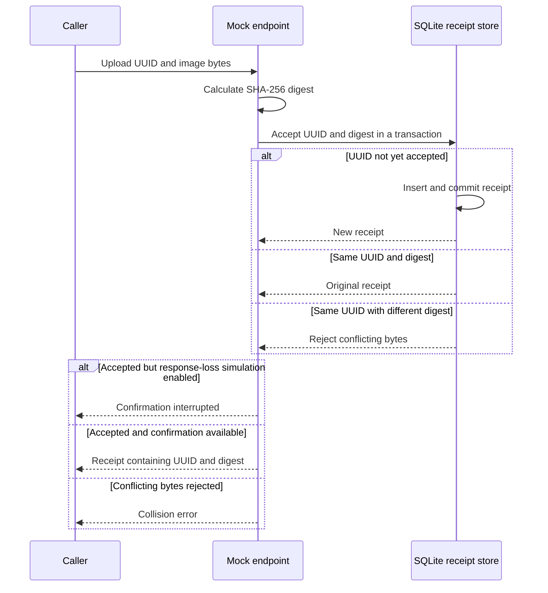
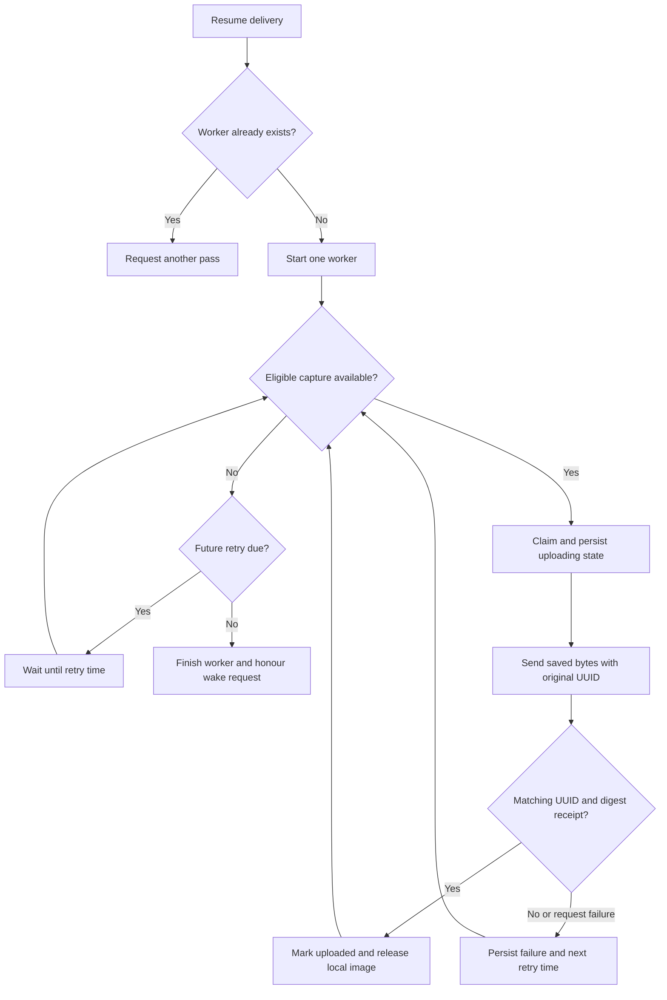
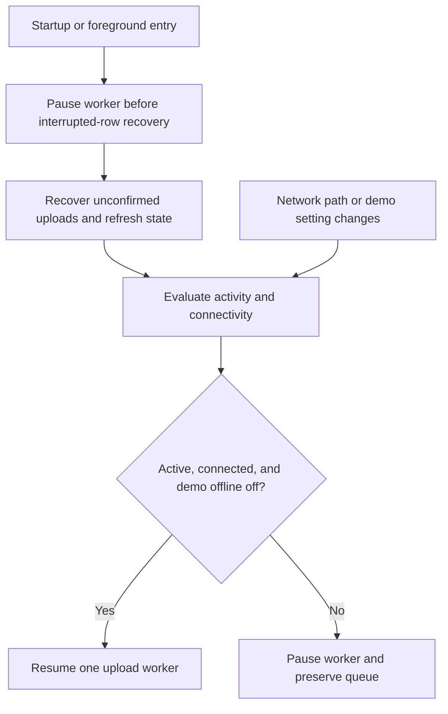
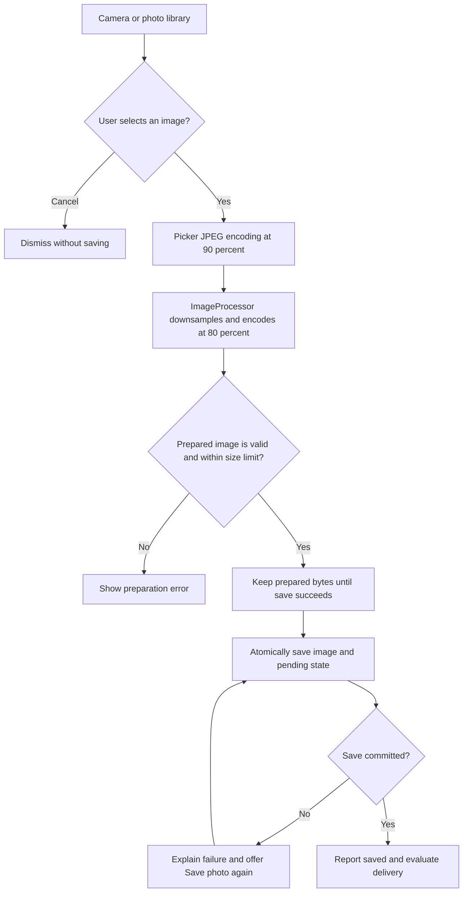
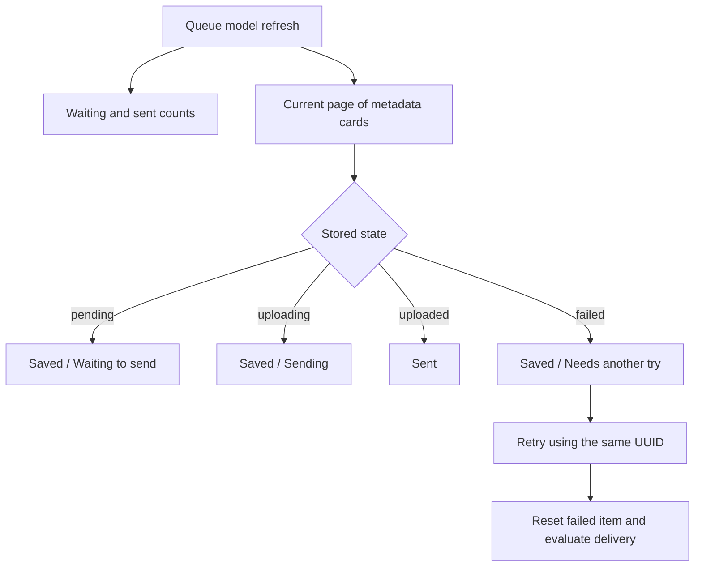
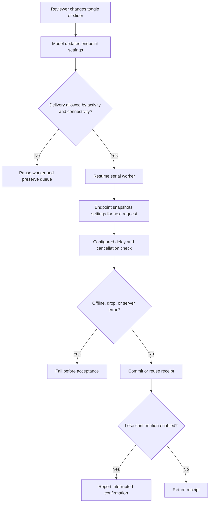
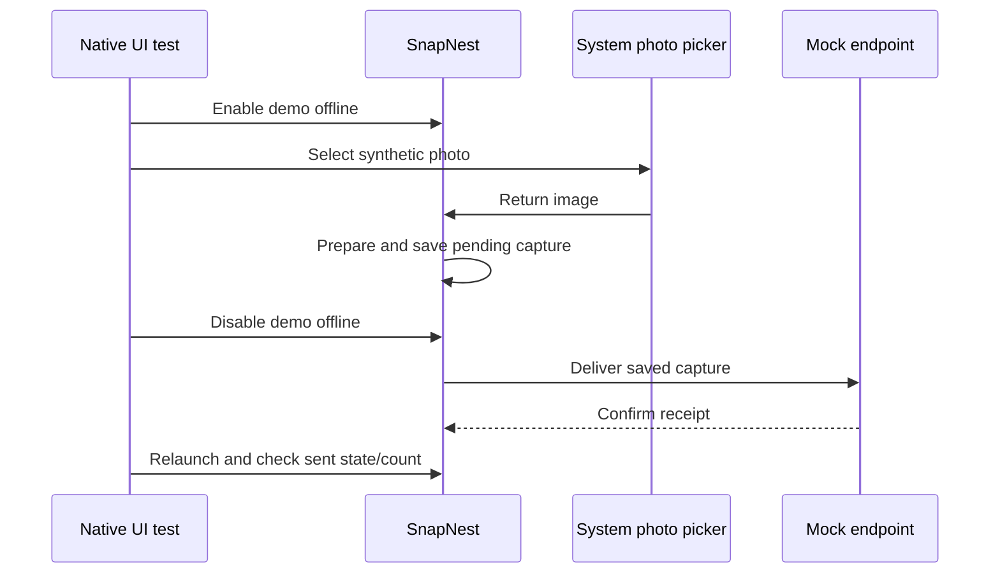
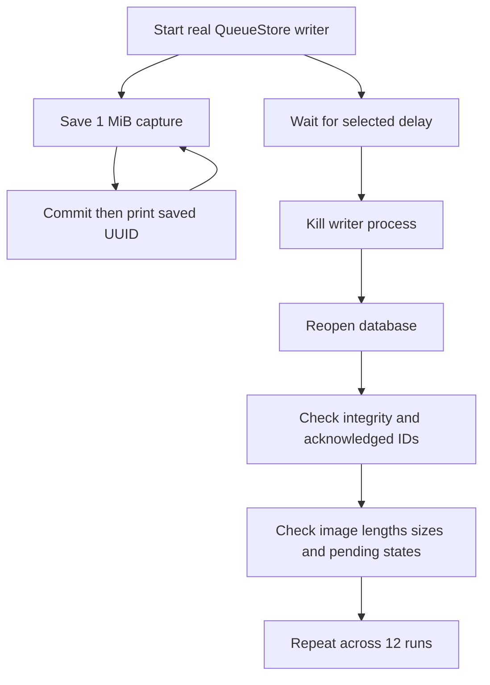
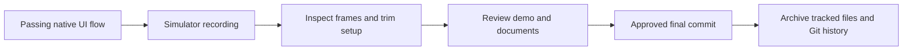

# Concepts and decisions

This document explains the concepts and choices as their components are introduced.

## Native iOS foundation

**Concept**
The assessment requires a native mobile application. The app interface and shared logic have different responsibilities.

**Decision**
Use Swift and SwiftUI with an iOS 17 minimum deployment target. Keep platform-independent models and delivery logic in a local `CaptureCore` Swift package. Its macOS 14 support allows the existing core tests to run on this Mac. There are no third-party runtime dependencies. iOS-specific camera, lifecycle, and UI integration belong in the app.

## Capture identity and image data

**Concept**
A capture needs one identity throughout saving, sending, and retrying. Loading every saved image just to display a history list would waste memory.

**Decision**
Use a UUID for each capture and preserve it across attempts. `CaptureItem` describes history metadata without image bytes; `UploadPayload` carries the image for delivery. The types distinguish selfies from document photos. Storage and delivery will implement these contracts in subsequent steps.

## Queue states

**Concept**
Saving a photo, attempting delivery, and receiving confirmation are different events. An unsuccessful attempt must not imply the photo was lost.

**Decision**
Define four states: `pending`, `uploading`, `uploaded`, and `failed`. Capture metadata includes attempts, the next eligible attempt time, and an explanatory message. `QueueSummary` provides counts and outstanding image bytes for the interface. SQLite queue operations now persist these transitions and recover interrupted uploading rows. The delivery worker now coordinates those operations.

## Delivery confirmation

**Concept**
A response must identify which capture was accepted and which image bytes it refers to. A retry after a lost response can otherwise create a duplicate.

**Decision**
Represent confirmation with an `UploadReceipt` containing the capture UUID and image digest. The worker validates both before marking a capture uploaded, and the mock receiver deduplicates repeated requests. The mock endpoint now calculates SHA-256 digests and records receipts. The coordinator now uses this transport; no live HTTP request is made.

## Retry policy

**Concept**
Repeated immediate attempts can overload an unavailable service. Automatic attempts also need a limit so persistent failures remain visible and actionable.

**Decision**
Use the existing policy of five automatic attempts, starting with a two-second retry delay and doubling subsequent delays. The delay function caps at 60 seconds; the five-attempt budget normally uses delays of 2, 4, 8, and 16 seconds. Manual retry renews the failed capture’s budget and wakes the coordinator. The existing unit test verifies exponential delay and the cap. Deterministic delays keep this prototype simple; fleet-wide retry jitter is not implemented.

## Durable photo storage

**Concept**
A captured photo must survive an app restart before delivery is attempted. “Saved” means its bytes and queue metadata have committed to disk. A photo still held in memory has not crossed that boundary.

**Decision**
Store image bytes, UUID, capture type, timestamp, and pending state together in one SQLite transaction. `BEGIN IMMEDIATE` starts the write transaction; the capacity check and insert happen inside it; `COMMIT` completes the save. A failure rolls the transaction back. This avoids coordinating separate image files with metadata. A duplicate ID is rejected without overwriting the original capture. The existing tests verify reopened bytes/state and rollback. Process-kill validation will be introduced in its planned later step.

The storage operation follows this path; camera/UI integration will call it in a later step.

## SQLite ownership and durability

**Concept**
Concurrent operations must not interleave halfway through a transaction, and the database connection must remain valid until its owner finishes using it.

**Decision**
Give one `QueueStore` actor ownership of one SQLite connection. Database operations are synchronous within the actor, so a transaction has no suspension point where another actor call can interleave. A private connection holder closes the handle when ownership ends; its narrow `@unchecked Sendable` declaration relies on this confinement. Use SQLite's DELETE rollback journal and FULL synchronization to prioritise committed-save durability over write throughput. These mechanisms do not protect against app uninstall, device loss, or arbitrary filesystem corruption.

## Storage bounds and reads

**Concept**
Image storage can consume disk space quickly. Rejecting a new capture must preserve the photos already saved. History reads should avoid loading all image bytes into memory.

**Decision**
Reuse the existing save-time limits: 10,000 total capture records, 512 MiB of outstanding image bytes, and 2 MiB per prepared image. Reject an empty or oversized payload before writing; reject a save that exceeds capacity inside the transaction; never evict a pending capture. This store validates payload size, not whether bytes decode into a real image. Read history as metadata with bounded pagination, and fetch image bytes separately by UUID. The byte cap measures logical image data, not database/journal overhead. The existing byte-capacity test is included now; the 10,000-record boundary and final-page pagination test are now included.

## Exclusive upload claims

**Concept**
Two overlapping requests must not select the same waiting capture. An attempt must be recorded before the image is handed to the uploader.

**Decision**
Within one SQLite transaction, select the oldest eligible pending or failed capture, change it to uploading, and increment its attempts. Return its UUID and image bytes only after commit. An uploading row is not eligible for another claim. The existing concurrent-claim test verifies that only one caller receives the payload. The coordinator also limits delivery to a single worker.

## Retry timing and manual retry

**Concept**
Retry timing must survive process restarts. A persistent failure should stop using automatic attempts while allowing the user to try again.

**Decision**
Persist each failure message and next-attempt timestamp. Claims require both a due timestamp and an attempt count below the supplied budget. Manual retry resets a failed capture to pending, clears its timing/message, and renews its budget while preserving its UUID and image. The existing test verifies an early claim is refused, the two-second initial delay is persisted, and manual retry returns the original image and ID. The coordinator now schedules automatic attempts using these persisted due times.

## Interrupted-upload recovery

**Concept**
After interruption, an uploading row has no locally confirmed outcome. The receiver might already have accepted it, even though the client did not record confirmation.

**Decision**
Recover uploading rows to pending, clear their timing/message, and refund the interrupted attempt. Reuse the original UUID so the later idempotent receiver can recognise a repeated request. Do not change confirmed uploaded rows. The existing recovery test reopens the database, reclaims the same ID, and verifies confirmed rows remain uploaded. App lifecycle integration now invokes this recovery; the mock endpoint handles deduplication.

## Confirmed-upload cleanup

**Concept**
Accepted photos no longer need their local image bytes, but removing sent history must never delete waiting photos. The database file can retain allocated pages after logical deletion.

**Decision**
For an uploading row, the storage operation marks it uploaded and releases its image BLOB and logical byte count. The worker calls this only after validating a receipt; the store does not validate a receipt itself. Sent-history cleanup deletes only uploaded rows and runs VACUUM to reclaim database space, requiring temporary disk headroom. The existing test verifies pending IDs and bytes remain intact. The 10,000-record policy counts sent metadata until it is cleared.

## Idempotent mock receiver

**Concept**
A receiver can accept an image even when its response never reaches the client. The client must be able to repeat the same request without creating a second accepted capture.

**Decision**
Use the existing in-app `MockEndpoint` behind an `UploadTransport` protocol. Calculate a SHA-256 digest of the delivered bytes and record the UUID/digest in SQLite. An atomic receipt transaction returns the same receipt for a repeated UUID and digest, and rejects the same UUID with different bytes. Receipts survive reopening; the existing test verifies persistence, deduplication, and collision rejection. This represents receiver acceptance in a permitted mock, not transmission to a real backend. App startup now creates a receipt database separate from the client's queue.

The diagram shows receipt handling inside the mock endpoint. The coordinator calls this transport; app UI integration is introduced later.

## Failure simulation at the transport boundary

**Concept**
Testing delivery needs controlled failures, including the ambiguous case where acceptance succeeds but confirmation is lost.

**Decision**
Reuse the endpoint's existing configurable offline mode, request-drop percentage, latency, server errors, and response loss after acceptance. Each request snapshots its settings; task cancellation is checked before acceptance. Response-loss simulation commits the receipt and then throws, allowing the worker tests to verify safe retries. The controls are now connected to the reviewer screen, and the existing coordinator tests exercise the failure scenarios.

## Receipt retention

**Concept**
Deleting the client's sent history must not make a repeated request appear new to the receiver.

**Decision**
Keep mock receipts independently of capture-history cleanup and retain them indefinitely in this prototype. The receipt database stores IDs and digests, not image bytes. Its growth is an explicit limitation separate from the bounded image queue; a production receiver would need a retention and duplicate-window contract.

## Serial upload coordination

**Concept**
Swift actors protect their state, but an actor can handle another call while a method is suspended at `await`. Actor isolation alone does not ensure that an entire upload request runs alone. A newly saved capture must also not be stranded as an earlier worker exits.

**Decision**
Reuse the existing `UploadCoordinator` actor with one owned worker task. Repeated resume calls request another pass instead of creating overlapping workers; a generation token protects worker cleanup. Claim one eligible capture at a time, notify observers, upload its saved bytes, and resolve the durable state before moving on. The existing tests verify repeated resumes and 25 successive captures do not strand items or duplicate transport calls. This predictable memory/concurrency policy trades throughput for simplicity.

## Confirmed delivery and whole-image retries

**Concept**
An upload attempt is not proof of delivery. A matching receipt is needed before local image bytes can be released. If confirmation is lost after acceptance, the client cannot tell whether the receiver committed.

**Decision**
Validate both the receipt UUID and SHA-256 digest against the payload. Only then mark the capture uploaded. Persist failures and their next retry time; wait for the earliest eligible attempt when none is due. Retry the entire saved image with the same UUID, relying on the mock receiver's idempotency. After five unsuccessful attempts, keep the image failed until manual retry resets its budget. Other eligible captures can still proceed. The existing tests cover transient success, exhaustion, progress beyond failed items, incorrect IDs/digests, and lost confirmation with one unique acceptance.

The diagram covers normal scheduling and outcomes. Failed captures at the attempt limit remain saved and ineligible until manual retry; cancellation follows the recovery path below.

## Pause, cancellation, and wake-up

**Concept**
Pausing while a request is active must leave a recoverable durable state. A confirmed response arriving during cancellation must not be discarded.

**Decision**
Pause disables and cancels the worker, then awaits its completion before recovery or new work. Request cancellation recovers unconfirmed uploading rows to pending. A matching receipt received despite cancellation is still honoured as confirmed success. Manual retry pauses the current worker to interrupt backoff, publishes the changed state, then resumes if delivery was enabled. Storage-worker errors are exposed through `lastError` while preserving the last durable state. The existing pause/resume test verifies the same capture ID is eventually sent. Foreground/connectivity integration now uses these pause and recovery operations.

## App model and startup

**Concept**
The UI needs one long-lived owner for storage, delivery, and displayed state. Redrawing a view must not create another queue worker.

**Decision**
Reuse the existing `@MainActor` observable `CaptureModel`, owned through `@StateObject` at app level. Startup opens the queue and separate mock-receipt databases in Application Support, recovers interrupted uploads, and starts connectivity monitoring. The directory is excluded from backups and uses iOS file protection until first unlock. Published properties stay on the UI actor; database operations remain in `QueueStore`. The model includes the existing save/retry/history and failure-setting orchestration. Capture controls call the save operation, and queue history now displays model state. Reviewer controls are now connected. The storage folder and monitor label use the SnapNest name.

## Foreground and connectivity gates

**Concept**
A durable queue can survive interruption without requiring the app to execute continuously in the background. Demo offline mode and actual network-path availability are separate conditions.

**Decision**
Observe SwiftUI scene activity and `NWPathMonitor`. Enable delivery only when the app is active, the path is satisfied, and demo offline is off. Otherwise pause the worker. On foreground entry, pause and await cleanup before recovering uploading rows, so recovery cannot steal an active worker's claim. Then re-evaluate delivery. There is no promise of continued sending while suspended or force quit; work resumes when the app is active again. A satisfied path is not proof of internet or server reachability, and the endpoint is still an in-app mock.

The existing coordinator tests simulate pause/resume and verify durable recovery. The native build verifies this integration compiles; physical Wi-Fi interruption and scene changes still need native/manual validation.

## Renewing network monitoring

**Concept**
A stale disconnected report can leave saved photos waiting after connectivity returns. Callbacks from an old monitor must not overwrite a newer monitor's state.

**Decision**
Reuse the working solution's monitor renewal on foreground entry, disabling demo offline, and the model's Check connection action. Cancel the old monitor and increment a generation token; ignore its later callbacks. Hop to the main actor before publishing connectivity and re-evaluating delivery. Do not force an online state. The Check connection button is now connected in the queue interface. The original host Wi-Fi failure was not reproduced under automated control, so this remains a recovery safeguard with an explicit manual-validation gap.

## Coherent UI refreshes

**Concept**
An older asynchronous refresh can finish after a newer page or state request and overwrite it. Publishing counts before history arrives can also briefly show inconsistent values.

**Decision**
Collect summary, paged metadata, receipt count, and coordinator errors before publishing them together on the main actor. A refresh generation token prevents older overlapping reads from replacing a newer result. This retains the existing solution's safeguard without introducing a new UI or production refactor.

## Native camera and library bridge

**Concept**
Users need to capture a selfie/document photo or choose a still image from their photo library. Cancellation should create no queue item, and denied camera permission needs a usable alternative.

**Decision**
Reuse the existing UIKit `UIImagePickerController` bridge inside SwiftUI for both sources. Prefer the front camera for selfies when available, and check/request camera permission before opening it. Denial explains that the user can enable access in Settings or choose a photo. Cancellation dismisses the picker without saving. The picker provides a decoded `UIImage`; there is no explicit input-extension allowlist or PDF/Word import. The existing working solution used this bridge after the alternative picker stalled in the simulator. Physical camera permission/capture/orientation behaviour still needs device validation.

## Image preparation

**Concept**
Full-resolution camera images can consume excessive memory, disk space, and mobile data. Prepared bytes must remain consistent across upload attempts.

**Decision**
Reuse the existing image path: encode the picker image as JPEG at 90% quality, then use the `ImageProcessor` actor and ImageIO to downsample with orientation correction to a maximum 1,600-pixel dimension and encode JPEG at 80% quality. Reject processing input above 30 MiB and prepared output above 2 MiB. The 30 MiB check occurs after picker encoding; it does not bound the original asset or decoded `UIImage` memory. Initial encoding runs on the UI actor, and the second encoding can cause additional quality loss. These are existing tradeoffs, not changes introduced in this step. Save the prepared bytes once; upload retries reuse them without recompression. Document readability still needs product/device validation.

## Capture save feedback

**Concept**
The UI must distinguish preparation, an uncommitted save, and a durable saved capture. A failed disk save must not silently discard the selected photo.

**Decision**
Reuse the existing two-step capture controls, busy state, and unsaved-image retry. Disable competing capture actions while preparing/saving or retaining an unsaved capture. Report saved only after `CaptureModel.save` returns success. Retain prepared bytes in memory after a save failure until another save succeeds; this is not durable protection against a process kill. Request a short UIKit background task around preparation/save for ordinary background transitions, without promising force-quit survival before commit. The native build checks compilation; the existing native picker/UI tests are introduced in the later validation step.

## Queue interface and status feedback

**Concept**
Users need to distinguish a safely saved photo from a confirmed upload, understand what is waiting, and recover failed delivery without creating another capture. Status must not depend on colour alone.

**Decision**
Reuse the existing history cards with text and icons for Saved / Waiting to send, Saved / Sending, Sent, and Saved / Needs another try. Show aggregate waiting/sent counts. Failed cards explain whether automatic retries remain or manual Retry is required; Retry uses the original capture ID. Display connectivity feedback and Check connection when the network monitor reports disconnection. Busy and unsaved-image feedback remain in the capture area. The layout scrolls and uses scalable text; full native UI and maximum-text validation arrive in the planned validation step.

## Pagination and sent-history controls

**Concept**
A 10,000-record queue should remain navigable without loading all records or image bytes into the interface. Users also need to free record capacity without deleting waiting captures.

**Decision**
Reuse the existing 50-record metadata pages with Previous photos and More photos controls. No thumbnails are decoded. Expose Remove sent photos from this list when sent history exists; the model invokes the store's uploaded-only cleanup and resets to the first page. This leaves pending/failed images and receiver receipts intact. Existing core tests verify the final capacity page and cleanup behaviour; the current native build verifies the controls compile.

## Runtime reviewer controls

**Concept**
Reviewers need to trigger unreliable delivery without rebuilding the app or depending on an actual server failure. They also need evidence that ambiguous success does not create duplicate acceptance.

**Decision**
Reuse the existing Demo controls sheet, opened through the sliders button. Toggles and sliders update the model's endpoint settings at runtime. Offline cancels the worker; other settings are snapshotted by the next request. Expose the durable unique-acceptance count and explain the duplicate contract. A separate storage section shows queue limits and offers uploaded-only history cleanup. Failure settings live in memory and reset on relaunch; captures and receipt evidence remain on disk. These are mock request outcomes, not packet-level faults or changes to real Wi-Fi speed.

The screen's Go offline gate normally pauses delivery before a new request reaches the endpoint; its transport-level offline setting is also exercised directly by core tests. A lost confirmation leaves a durable receipt for the next attempt to reuse.

## Distinguishing simulated and real disconnection

**Concept**
Turning demo offline off does not establish real connectivity. A generic disconnected banner can obscure which gate is preventing delivery.

**Decision**
Reuse the existing separate explanations: demo offline asks the user to turn off the demo switch, while an unsatisfied network path shows No connection and Check connection. Monitor renewal requests a fresh report without pretending the device is online. The original real host Wi-Fi interruption remains a manual-validation gap; a successful demo toggle test is not proof that scenario is resolved.

## Native UI validation and synthetic evidence

**Concept**

Core tests establish storage and delivery contracts, while native UI tests check that a user can reach those behaviours through the real SwiftUI controls and system photo picker.

**Decision**

Include the existing three XCTest UI scenarios in the shared Xcode scheme: capture while demo offline, resume before relaunch and preserve the acceptance count after relaunch; toggle demo offline repeatedly; and reach Choose photo at maximum Dynamic Type. Use the synthetic document fixture without personal identity data. The picker runs in a separate system process; prefer its accessible photo element, with the existing inspected iOS 27 first-tile fallback when the grid is absent. Keep result bundles local and publish only selected screenshots and accurate validation notes. This adds test configuration and evidence without changing application behaviour.

This scenario relaunches after confirmation. Interrupted-upload recovery is covered by core tests; process-kill stress validation is a separate next step. Maximum-text reachability does not establish VoiceOver or physical-camera behaviour.

## Abrupt process termination evidence

**Concept**

A normal reopen test does not exercise an operating system terminating the writer while it is working. Once save reports success, the capture must remain recoverable.

**Decision**

Reuse the existing QueueProbe executable and crash stress script. The probe saves 1 MiB captures through QueueStore and prints UUIDs only after save returns. The script kills that process at 12 delays, reopens temporary databases, and checks SQLite integrity, acknowledged IDs, image length/size, and pending state. Keep this as a macOS developer validation tool with no production app changes. Describe its timing and platform limitations explicitly; the script does not choose the exact commit instruction or compare every image byte.

## Demonstration and submission artifacts

**Concept**

A short recording makes the implemented flow reviewable, while a source archive preserves the code and its incremental Git history. Explanations also need to state the limits of the evidence.

**Decision**

Reuse the existing native UI recording, frame inspection, trimming, and tracked-source packaging helpers with SnapNest names. Record the actual passing test and trim setup time only; keep the movie under 60 seconds. Keep raw movies and diagnostics local. Preserve selected stage screenshots and provide the Flutter-to-Swift walkthrough for follow-up preparation. Generate the archive after the final reviewed commit so its tracked-file list includes the final artifacts.

## App branding and README preview

**Concept**

A shared visual identity makes the launcher, startup, and capture screen recognisable. A short README preview helps reviewers see the implemented flow before running it.

**Decision**

Use the same camera-and-nest logo for the launcher and beside the app name. The native launch storyboard uses a matching blue background with white text; it adds no artificial startup delay. Add a 320-pixel-wide GIF before Run in the README, sampled at ten frames per second from the passing native capture test. Trim initial test setup, retain the original sequence and speed, and keep the existing full demonstration video.
