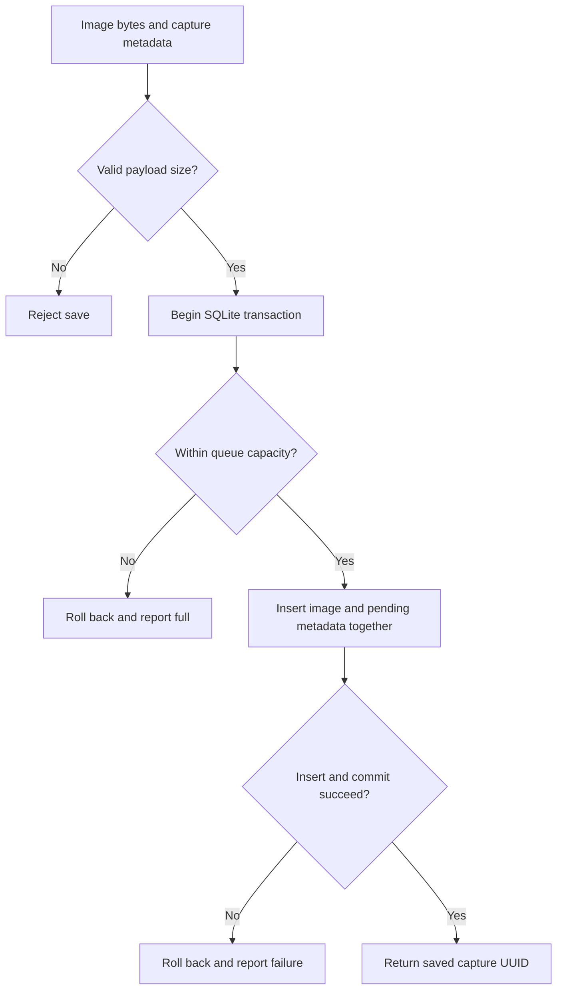
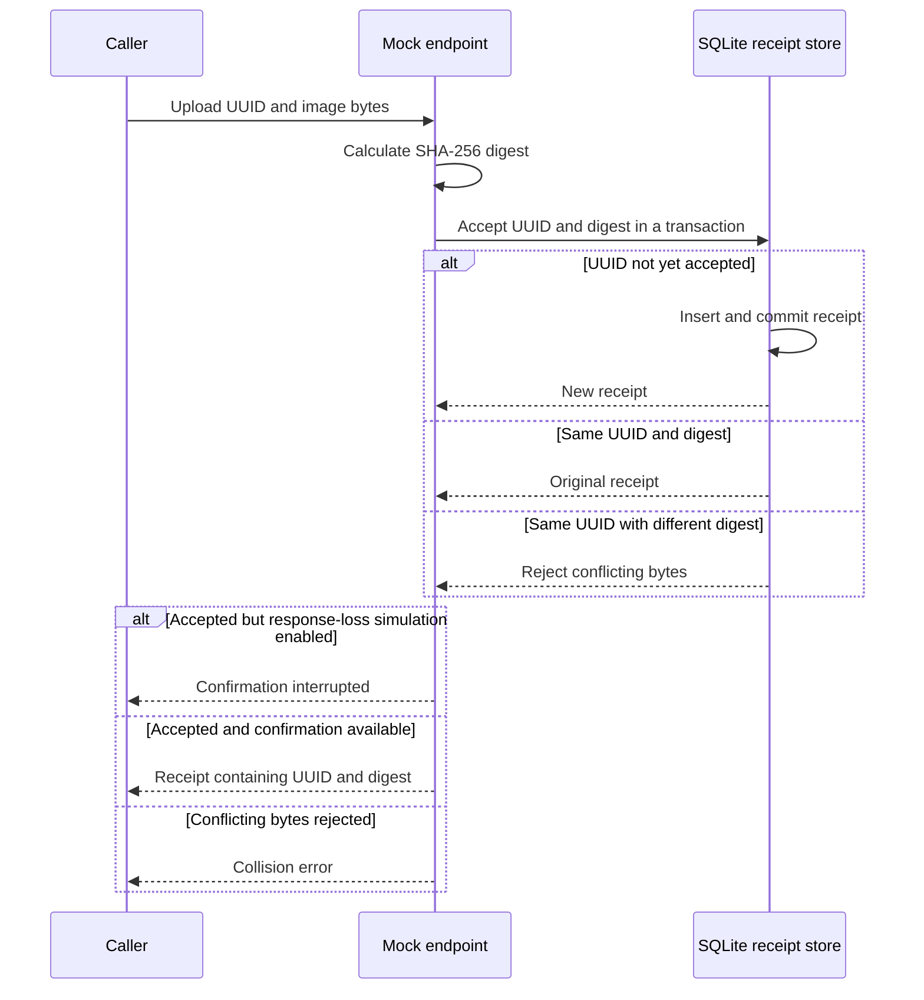

# Concepts and decisions

This document explains the concepts and choices as their components are introduced.

## Native iOS foundation

**Concept**
The assessment requires a native mobile application. The app interface and shared logic have different responsibilities.

**Decision**
Use Swift and SwiftUI with an iOS 17 minimum deployment target. Keep platform-independent models and delivery logic in a local `CaptureCore` Swift package. Its macOS 14 support allows the existing core tests to run on this Mac. There are no third-party runtime dependencies. iOS-specific camera, lifecycle, and UI integration belong in the app.

## Capture identity and image data

**Concept**
A capture needs one identity throughout saving, sending, and retrying. Loading every saved image just to display a history list would waste memory.

**Decision**
Use a UUID for each capture and preserve it across attempts. `CaptureItem` describes history metadata without image bytes; `UploadPayload` carries the image for delivery. The types distinguish selfies from document photos. Storage and delivery will implement these contracts in subsequent steps.

## Queue states

**Concept**
Saving a photo, attempting delivery, and receiving confirmation are different events. An unsuccessful attempt must not imply the photo was lost.

**Decision**
Define four states: `pending`, `uploading`, `uploaded`, and `failed`. Capture metadata includes attempts, the next eligible attempt time, and an explanatory message. `QueueSummary` provides counts and outstanding image bytes for the interface. SQLite queue operations now persist these transitions and recover interrupted uploading rows. The delivery worker will coordinate those operations in a later step.

## Delivery confirmation

**Concept**
A response must identify which capture was accepted and which image bytes it refers to. A retry after a lost response can otherwise create a duplicate.

**Decision**
Represent confirmation with an `UploadReceipt` containing the capture UUID and image digest. The later worker will validate both before marking a capture uploaded, and the mock receiver will deduplicate repeated requests. The mock endpoint now calculates SHA-256 digests and records receipts. There is no delivery worker or live HTTP request yet.

## Retry policy

**Concept**
Repeated immediate attempts can overload an unavailable service. Automatic attempts also need a limit so persistent failures remain visible and actionable.

**Decision**
Use the existing policy of five automatic attempts, starting with a two-second retry delay and doubling subsequent delays. The delay function caps at 60 seconds; the five-attempt budget normally uses delays of 2, 4, 8, and 16 seconds. Manual retry will renew the budget when the coordinator is introduced. The existing unit test verifies exponential delay and the cap. Deterministic delays keep this prototype simple; fleet-wide retry jitter is not implemented.

## Durable photo storage

**Concept**
A captured photo must survive an app restart before delivery is attempted. “Saved” means its bytes and queue metadata have committed to disk. A photo still held in memory has not crossed that boundary.

**Decision**
Store image bytes, UUID, capture type, timestamp, and pending state together in one SQLite transaction. `BEGIN IMMEDIATE` starts the write transaction; the capacity check and insert happen inside it; `COMMIT` completes the save. A failure rolls the transaction back. This avoids coordinating separate image files with metadata. A duplicate ID is rejected without overwriting the original capture. The existing tests verify reopened bytes/state and rollback. Process-kill validation will be introduced in its planned later step.

The storage operation follows this path; camera/UI integration will call it in a later step.

## SQLite ownership and durability

**Concept**
Concurrent operations must not interleave halfway through a transaction, and the database connection must remain valid until its owner finishes using it.

**Decision**
Give one `QueueStore` actor ownership of one SQLite connection. Database operations are synchronous within the actor, so a transaction has no suspension point where another actor call can interleave. A private connection holder closes the handle when ownership ends; its narrow `@unchecked Sendable` declaration relies on this confinement. Use SQLite's DELETE rollback journal and FULL synchronization to prioritise committed-save durability over write throughput. These mechanisms do not protect against app uninstall, device loss, or arbitrary filesystem corruption.

## Storage bounds and reads

**Concept**
Image storage can consume disk space quickly. Rejecting a new capture must preserve the photos already saved. History reads should avoid loading all image bytes into memory.

**Decision**
Reuse the existing save-time limits: 10,000 total capture records, 512 MiB of outstanding image bytes, and 2 MiB per prepared image. Reject an empty or oversized payload before writing; reject a save that exceeds capacity inside the transaction; never evict a pending capture. This store validates payload size, not whether bytes decode into a real image. Read history as metadata with bounded pagination, and fetch image bytes separately by UUID. The byte cap measures logical image data, not database/journal overhead. The existing byte-capacity test is included now; the 10,000-record boundary and final-page pagination test are now included.

## Exclusive upload claims

**Concept**
Two overlapping requests must not select the same waiting capture. An attempt must be recorded before the image is handed to the uploader.

**Decision**
Within one SQLite transaction, select the oldest eligible pending or failed capture, change it to uploading, and increment its attempts. Return its UUID and image bytes only after commit. An uploading row is not eligible for another claim. The existing concurrent-claim test verifies that only one caller receives the payload. The later coordinator will also limit delivery to a single worker.

## Retry timing and manual retry

**Concept**
Retry timing must survive process restarts. A persistent failure should stop using automatic attempts while allowing the user to try again.

**Decision**
Persist each failure message and next-attempt timestamp. Claims require both a due timestamp and an attempt count below the supplied budget. Manual retry resets a failed capture to pending, clears its timing/message, and renews its budget while preserving its UUID and image. The existing test verifies an early claim is refused, the two-second initial delay is persisted, and manual retry returns the original image and ID. No automatic worker runs yet.

## Interrupted-upload recovery

**Concept**
After interruption, an uploading row has no locally confirmed outcome. The receiver might already have accepted it, even though the client did not record confirmation.

**Decision**
Recover uploading rows to pending, clear their timing/message, and refund the interrupted attempt. Reuse the original UUID so the later idempotent receiver can recognise a repeated request. Do not change confirmed uploaded rows. The existing recovery test reopens the database, reclaims the same ID, and verifies confirmed rows remain uploaded. Lifecycle integration and remote deduplication are introduced later.

## Confirmed-upload cleanup

**Concept**
Accepted photos no longer need their local image bytes, but removing sent history must never delete waiting photos. The database file can retain allocated pages after logical deletion.

**Decision**
For an uploading row, the storage operation marks it uploaded and releases its image BLOB and logical byte count. Only the future worker may call this after validating a receipt; the store does not validate a receipt itself. Sent-history cleanup deletes only uploaded rows and runs VACUUM to reclaim database space, requiring temporary disk headroom. The existing test verifies pending IDs and bytes remain intact. The 10,000-record policy counts sent metadata until it is cleared.

## Idempotent mock receiver

**Concept**
A receiver can accept an image even when its response never reaches the client. The client must be able to repeat the same request without creating a second accepted capture.

**Decision**
Use the existing in-app `MockEndpoint` behind an `UploadTransport` protocol. Calculate a SHA-256 digest of the delivered bytes and record the UUID/digest in SQLite. An atomic receipt transaction returns the same receipt for a repeated UUID and digest, and rejects the same UUID with different bytes. Receipts survive reopening; the existing test verifies persistence, deduplication, and collision rejection. This represents receiver acceptance in a permitted mock, not transmission to a real backend. When app integration arrives, receipts will use a database separate from the client's queue.

The diagram shows receipt handling inside the mock endpoint. Its caller is not yet connected to an app upload worker.

## Failure simulation at the transport boundary

**Concept**
Testing delivery needs controlled failures, including the ambiguous case where acceptance succeeds but confirmation is lost.

**Decision**
Reuse the endpoint's existing configurable offline mode, request-drop percentage, latency, server errors, and response loss after acceptance. Each request snapshots its settings; task cancellation is checked before acceptance. Response-loss simulation commits the receipt and then throws, allowing the later worker tests to verify safe retries. These controls are not connected to a screen yet, and the failure scenarios will be exercised by the existing coordinator tests when that component is introduced.

## Receipt retention

**Concept**
Deleting the client's sent history must not make a repeated request appear new to the receiver.

**Decision**
Keep mock receipts independently of capture-history cleanup and retain them indefinitely in this prototype. The receipt database stores IDs and digests, not image bytes. Its growth is an explicit limitation separate from the bounded image queue; a production receiver would need a retention and duplicate-window contract.
